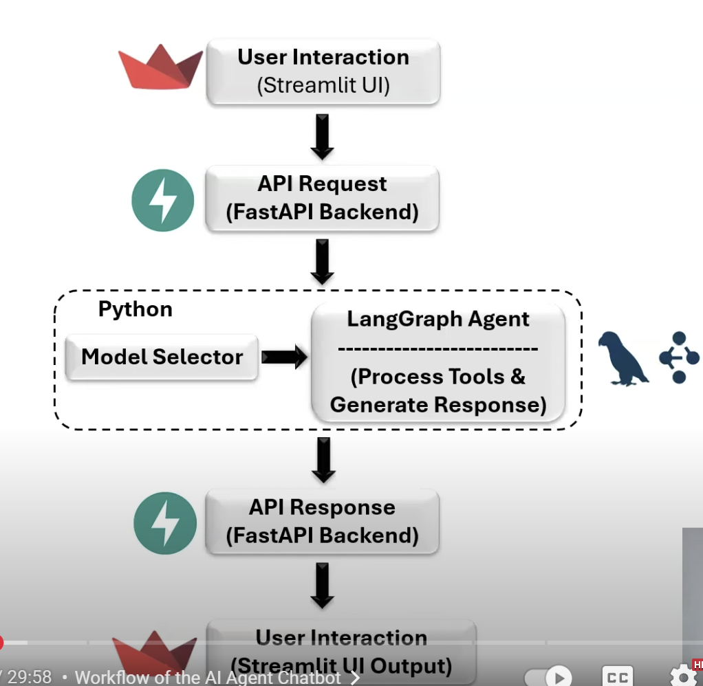

- Develop langgraph agent-->streamlit UI-->FastAPI to create an endpoint-->use endpoint to connect to the server
- 

- Rest API
    - “A REST API is a stateless, HTTP-based interface for exposing and consuming resources, typically in JSON format. In my ML workflows, I often use REST APIs to expose model predictions, integrate with data ingestion pipelines, or trigger retraining jobs from external services.

Each resource is addressable via a URI, and operations are mapped to standard HTTP verbs — for example, POST /predict to send input features and get predictions, or GET /metrics to retrieve live model performance.

I ensure that APIs I design are versioned, follow OpenAPI standards for documentation, and include input/output validation using tools like Pydantic or Marshmallow. I also emphasize security, idempotency for PUT/DELETE, and proper error handling with meaningful status codes — which is critical in production ML systems.

REST's statelessness aligns well with containerized, horizontally scalable ML services deployed via orchestrators like Kubernetes. That separation of concerns — API as a thin interface over a model service — helps keep systems modular, observable, and maintainable.”
    - Characteristics
        - Separation of client and server
        - Consistent interface
        - statelesness: Each request carries all the information
        - Cache: Tells client how to store the data
        - multi-layered
        - code execution

    - Representational state transfer
    - Rest API acts as a bridge that seamlessly connecting all the components together
    - Frond end, back end, server, cloud
    - Method: Get, put, post, delete
    - URL- endpoint on the server where the request is processed
    - Body: Actual information being sent to the server, prompt, parameters

    - Langgraph.prebuilt import create_react_agent takes in the llm, tools and the state
    - langchain_groq.ChatGroq is used to initialize the llm

    User → Agent → LLM → Tools (e.g., Tavily) → Real-time Data
                        ↓
                  Vector Store (for RAG)

These make it easier to build with LLMs:

Category	Tool/Service	Purpose
Agents	LangChain, LangGraph, CrewAI	Build multi-step intelligent LLM systems
Tools	Tavily, SerpAPI, OpenAI Function Calling	External tools for real-world info
Hosting	Groq, Replicate, Together.ai, OpenRouter	Run or access LLMs
RAG	LlamaIndex, LangChain, Haystack	Retrieval-Augmented Generation from documents
Vector DBs	Pinecone, Weaviate, Chroma, Qdrant	Store and search documents for RAG
Embeddings	OpenAI, Hugging Face, Cohere	Convert text to vectors
Evaluation	TruLens, Ragas, LangSmith	Evaluate LLM quality and performance